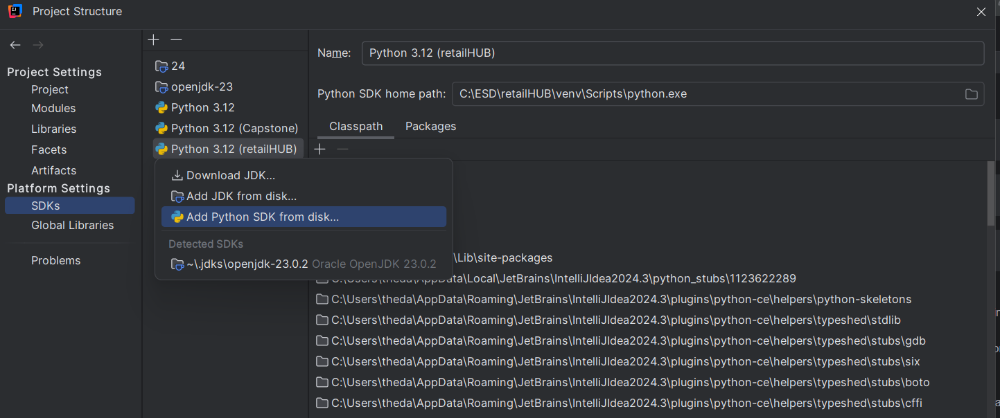
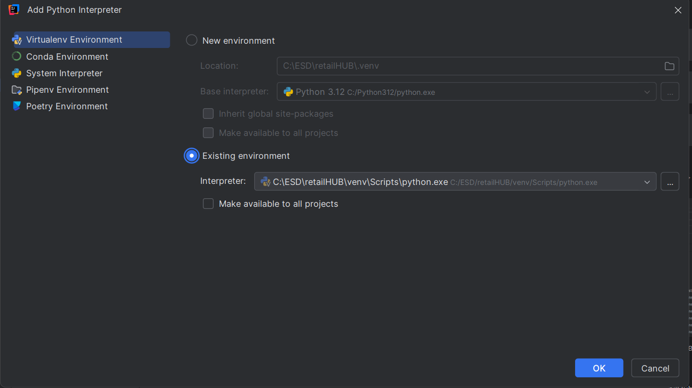
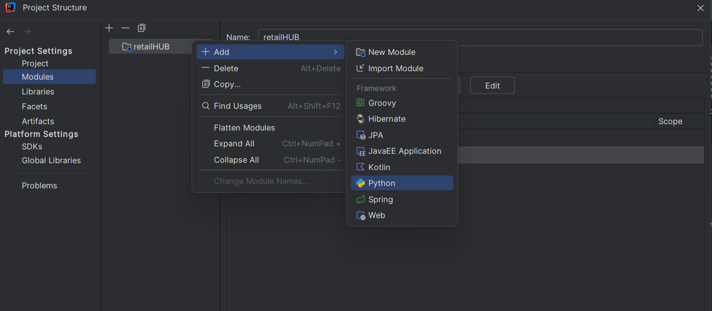

# Project Setup

## One time installation:

1. Clone the repository:
   ```bash
   git clone https://github.com/Omada-K/retailHUB.git
   ```
   ```bash
   cd <your location>/retailHUB
   ```

2. Activate python
   ```bash
   python -m venv venv
   ```
   ```bash
   venv\Scripts\activate
   ```
   ```bash
   pip install -r requirements.txt
   ```

Wait for installation to finish. You can close the console.

3. To add python sdk:

  - In IntelliJ, go to File > Project Structure > Platform Settings > SDKs.
  - Click the "+" button and select "Add Python SDK".
    
  - Choose "Existing Environment" and point it to the Python interpreter inside the virtual
    environment.
  - In the retailHUB directory: venv\Scripts\python.exe
    
  - Go to Project Settings > Modules. Right click on the retailHub folder. add > Python
  - On the right panel select
    
  - Apply the changes.

## Pulling from dev.

This step happens every time we want to download the latest "dev" to start working.

Switch to dev, create an empty dev branch:

```bash
    git checkout dev 
```

Download and 'fill' the local dev branch with customers from github.

```bash
    git pull origin/dev
```

Now we see the latest state of the dev branch.

## Creating a new branch.

This step happens when we want upload our code to git hub.

```bash
git checkout -b python/cleanning-script
```

```bash
git add .
```

```bash
git commit -m 'message of what we did'
```

```bash
git push origin new-branch-name
```

If we have created our branch and we just want to upload more changes:

```bash
git add .
```

```bash
git commit -m 'message of what we did'
```

```bash
git push
```

## Usefull commands

```bash
git status 
```

Shows if there are differences between your local branch and github branch.

```bash
git branch
```

Show all the local branches(on your pc), and which is selected currently

```bash
git branch -r
```

Shows all branches on gitHub. -r => remote.