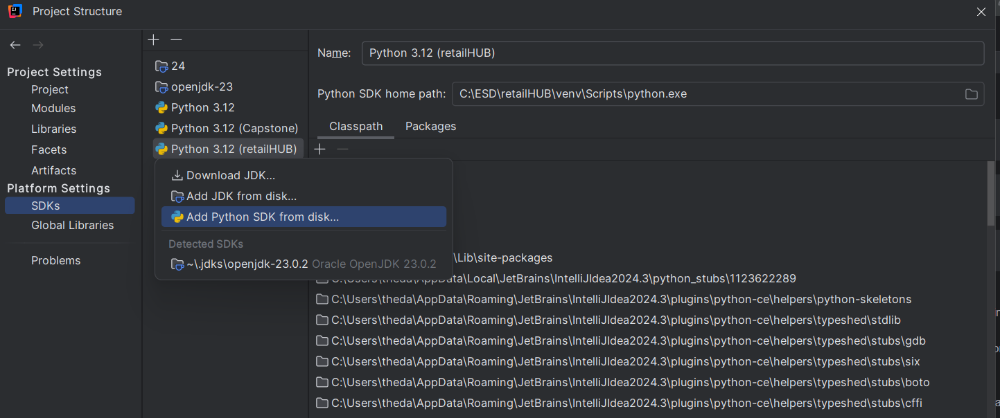
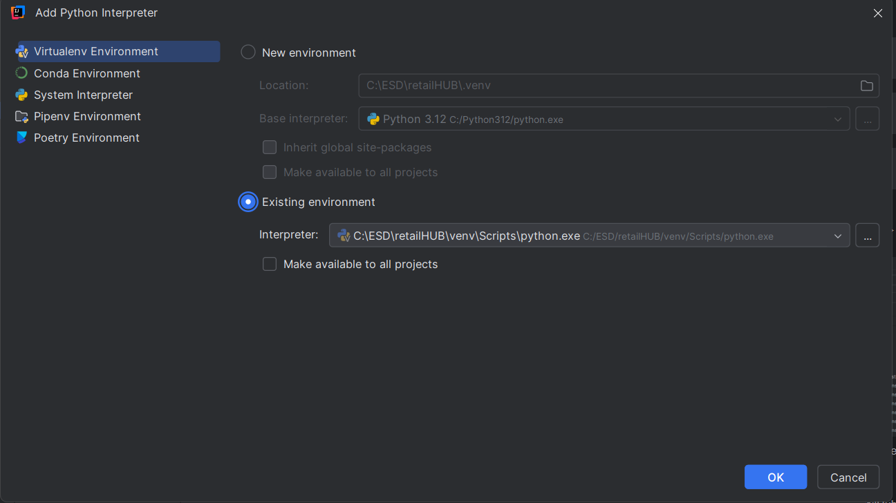
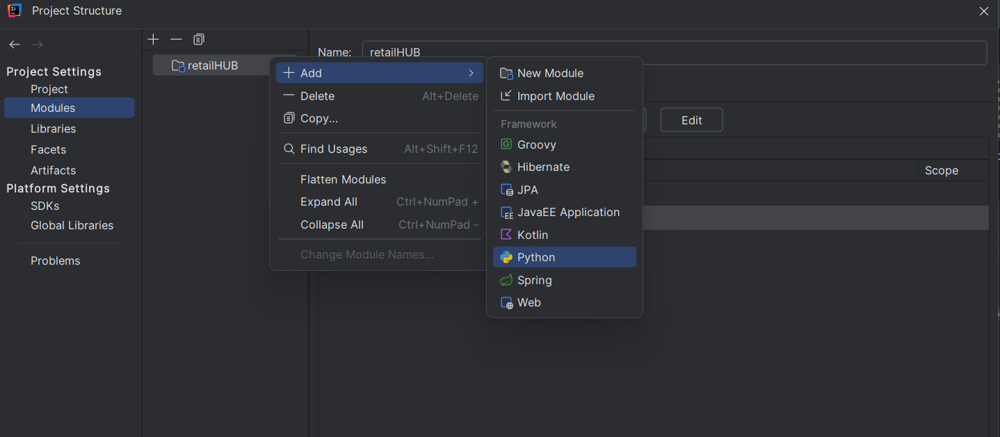

# Project Setup

## First time installation:
1. Clone the repository:
   ```bash
   git clone https://github.com/Omada-K/retailHUB.git
   ```
   ```bash
   cd /retailHUB
   ```

2. Activate python
   ```bash
   python -m venv venv
   ```
   ```bash
   venv\Scripts\activate
   ```
   ```bash
   pip install -r requirements.txt
   ```


3. To add python sdk:

    - In IntelliJ, go to File > Project Structure > Platform Settings > SDKs.
    - Click the "+" button and select "Add Python SDK".
   
    - Choose "Existing Environment" and point it to the Python interpreter inside the virtual
      environment.
    - In the retailHUB directory: venv\Scripts\python.exe
   
    - Go to Project Settings > Modules. Right click on the retailHub folder. add > Python
    - On the right panel select 
   
    - Apply the changes.

